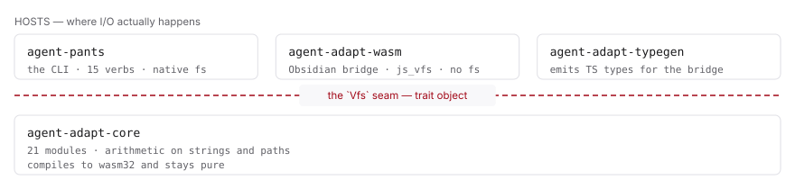
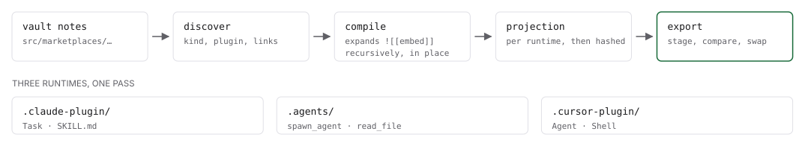
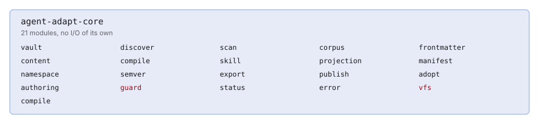
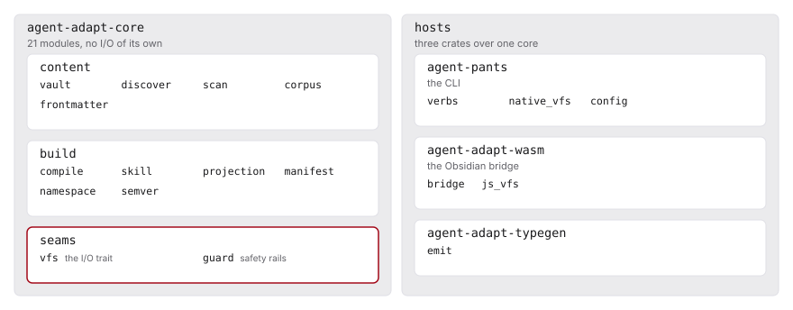

# Structural diagrams

`explore-codebase --html` writes a self-contained page that carries diagrams of
the structure it found. This page explains what those diagrams are, when each
one is the right choice, and how a skill produces them.

The rule the renderer exists to enforce: **the agent never writes the SVG.** It
writes a JSON payload describing content and shape. `render_map.mjs` turns that
into the page. The split is the point — a payload cannot produce an SVG that
overflows its box, overlaps its own labels, or disappears in dark mode, because
those are not things a payload is able to say.

```text
node <skill-dir>/render_map.mjs map.json repo-map.html
```

The contract is
[`map-page.schema.json`](../src/marketplaces/sdlc/plugins/codebase/skills/explore-codebase/map-page.schema.json).
The renderer validates the payload before it writes anything and fails with the
field path of each bad value.

## The page

A payload is a title, a one-line lede, an optional meta line, and a list of
sections. Each section is a heading and a list of blocks.

| Block | Holds |
| --- | --- |
| `p` | A paragraph. Supports `` `code` `` and `**bold**`. |
| `ul` | A bullet list. |
| `table` | A head row and body rows. |
| `panel` | Boxed-out prose, for a caveat or a conclusion. |
| `figure` | A diagram, with a caption. |

Section headings become a contents rail down the left of the page. The rail
keeps its position while the page scrolls, scrolls on its own once it outgrows
the window, and marks the section in view. It appears once a page has three
sections.

## The four diagram kinds

Each `figure` holds one diagram. There are four kinds, chosen by what the
shape actually is rather than by how it should look.

### `layers` — tiers separated by a seam

Rows stacked top to bottom. An optional boundary cuts between two of them and
carries a label. Reach for it when the finding is that one group of things can
do something another group cannot.

<picture>
  <source media="(prefers-color-scheme: dark)" srcset="images/layers-dark.svg">
  
</picture>

```jsonc
{
  "kind": "layers",
  "boundary": { "after": 0, "label": "the `Vfs` seam — trait object" },
  "layers": [
    { "label": "HOSTS — where I/O actually happens", "boxes": [ /* … */ ] },
    { "boxes": [ { "title": "agent-adapt-core", "lines": ["…"] } ] }
  ]
}
```

`boundary.after` is the index of the layer the line sits below, so it must
point at a layer that has another one under it. Without a boundary the layers
are joined by arrows instead; set `"arrows": "none"` to drop those too.

Full payload: [`examples/layers.json`](examples/layers.json).

### `pipeline` — ordered stages

Stages left to right, joined by arrows, optionally fanning out to the artifacts
the last stage produces. Reach for it when you have traced a flow and the order
is the finding.

<picture>
  <source media="(prefers-color-scheme: dark)" srcset="images/pipeline-dark.svg">
  
</picture>

```jsonc
{
  "kind": "pipeline",
  "stages": [
    { "title": "vault notes", "lines": ["src/marketplaces/…"] },
    { "title": "export", "lines": ["stage, compare, swap"], "accent": "good" }
  ],
  "outputs": { "label": "THREE RUNTIMES, ONE PASS", "boxes": [ /* … */ ] }
}
```

Full payload: [`examples/pipeline.json`](examples/pipeline.json).

### `inventory` — a named container and its members

A labelled box holding a grid of names. Reach for it when membership is the
finding: which modules a crate has, which commands a CLI exposes.

<picture>
  <source media="(prefers-color-scheme: dark)" srcset="images/inventory-dark.svg">
  
</picture>

```jsonc
{
  "kind": "inventory",
  "label": "agent-adapt-core",
  "sublabel": "21 modules, no I/O of its own",
  "columns": 5,
  "items": [
    { "name": "vault" },
    { "name": "vfs", "accent": "bad" },
    { "name": "semver", "note": "version arithmetic" }
  ]
}
```

Full payload: [`examples/inventory.json`](examples/inventory.json).

### `containment` — what holds what

Boxes inside boxes, up to three levels deep. A group holds either a roster of
names or more groups, never both. Reach for it when the nesting is the
finding: which unit owns which modules, and which of those everything else
depends on.

<picture>
  <source media="(prefers-color-scheme: dark)" srcset="images/containment-dark.svg">
  
</picture>

```jsonc
{
  "kind": "containment",
  "columns": 2,
  "groups": [
    {
      "title": "agent-adapt-core",
      "sublabel": "21 modules, no I/O of its own",
      "columns": 1,
      "groups": [
        { "title": "content", "items": [{ "name": "vault" }, { "name": "scan" }] },
        { "title": "seams", "accent": "bad", "items": [{ "name": "vfs", "note": "the I/O trait" }] }
      ]
    }
  ]
}
```

Group by what the modules do, not by the folders they sit in. If the groups
end up named after directories and holding exactly their contents, the diagram
is a directory tree and should be dropped — `ls` already told the reader that.

Depth is capped at three. A roster fills the width it is given, so `columns`
only controls how many child *groups* sit side by side.

Full payload: [`examples/containment.json`](examples/containment.json).

### `raw` — the escape hatch

`raw` takes hand-authored SVG and a viewBox. It exists so an unusual shape is
possible, not so it is easy: raw markup skips validation, layout and the
overflow guarantee. Prefer one of the four kinds. If you reach for `raw` a
second time, propose a fifth kind instead.

## Accents

A box, a stage or an inventory item takes an optional `accent`. There are four
values and they carry meaning, not decoration:

| Accent | Says |
| --- | --- |
| `none` | The default. Nothing to flag. |
| `good` | This is the healthy path, or the thing that works. |
| `warn` | Worth knowing about before you touch it. |
| `bad` | The risk. Where the bugs live, or what breaks if you change it. |

A `containment` group takes an accent too, which outlines the whole group
rather than one name.

Accent sparingly. A diagram where everything is accented says nothing.

## Width and themes

Every colour is a CSS custom property, so both light and dark themes come from
one payload and neither is an afterthought.

Diagrams lay out against an 880-unit viewBox. A row whose content needs more
than an even share of that width makes the diagram wider rather than clipping
the label; because the SVG renders at `width:100%`, a wider viewBox scales the
whole diagram down uniformly and nothing is cut.

That is a guarantee, so it is tested rather than asserted:

```bash
node scripts/check-diagrams.mjs                    # stress payloads
node scripts/check-diagrams.mjs docs/images/*.svg  # the images on this page
```

The check estimates the width of every label and fails if one runs past its box
or past the viewBox.

## Regenerating the images on this page

The images are rendered from [`examples/`](examples) by the skill's own
renderer, so they cannot show a shape the renderer will not actually produce.

```bash
node scripts/build-doc-images.mjs          # rewrite docs/images/
node scripts/build-doc-images.mjs --check  # fail if they are stale
```

Each example produces a light and a dark SVG. Colour tokens are substituted
literally at build time, so the files carry no stylesheet and render correctly
on hosts that serve SVG under a strict content security policy.
